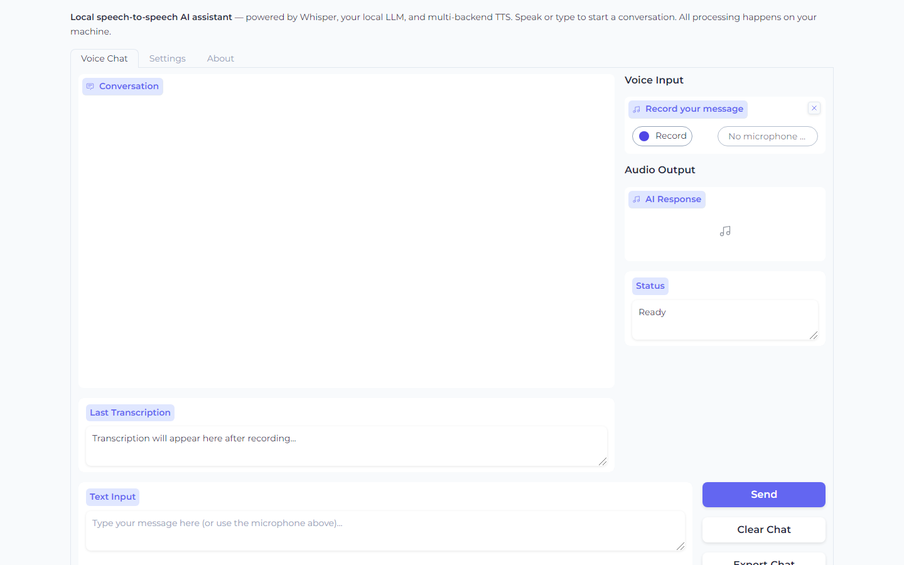
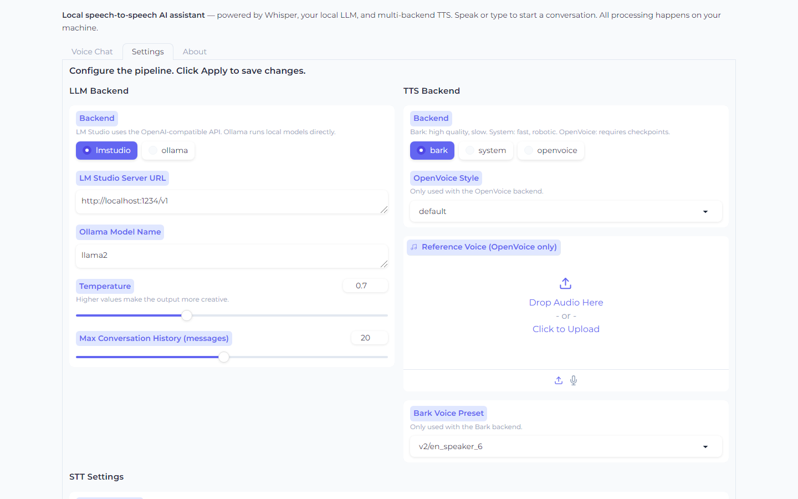
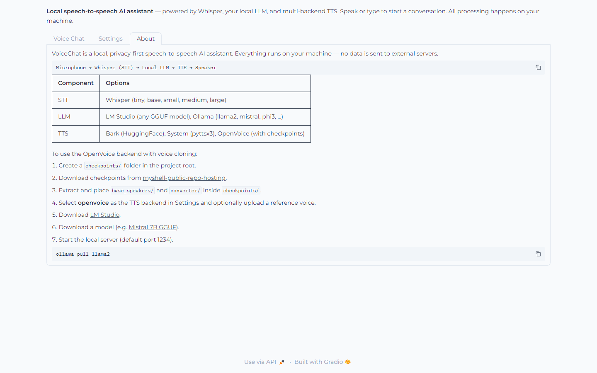

# VoiceChat — Local Speech-to-Speech AI

> A fully local, privacy-first voice assistant that listens, thinks, and speaks — all on your machine.

[](https://python.org)
[](LICENSE)
[](https://gradio.app)

---

## Overview

VoiceChat connects three local AI components into a seamless voice conversation loop:

```
Microphone ──► Whisper (STT) ──► Local LLM ──► TTS Engine ──► Speaker
```

No API keys. No cloud. No data leaving your device.

---

## Features

- **Full web UI** built with Gradio — chat with voice or text from a browser
- **Multiple TTS backends** — Bark (high quality), System (fast), OpenVoice (voice cloning)
- **Multiple LLM backends** — LM Studio (any GGUF model) or Ollama
- **Whisper STT** — accurate transcription across five model sizes
- **Voice cloning** — upload a reference voice sample with the OpenVoice backend
- **Conversation history** with export to text file
- **GPU and CPU** support — Bark and Whisper use GPU if available, CPU otherwise
- **Configurable from the UI** — change backends, prompts, and parameters without restarting

---

## Project Structure

```
Speech-to-Speech-Local-LLM/
├── main.py               # Entry point
├── requirements.txt
├── src/
│   ├── config.py         # Dataclass configuration
│   ├── audio.py          # Audio utilities
│   ├── stt.py            # Whisper transcription
│   ├── llm.py            # LM Studio and Ollama clients
│   ├── pipeline.py       # Orchestration pipeline
│   └── tts/
│       ├── bark.py       # Bark TTS backend
│       ├── system.py     # pyttsx3 system TTS backend
│       └── openvoice.py  # OpenVoice voice-cloning backend
├── openvoice/            # OpenVoice model code
│   ├── api.py
│   ├── se_extractor.py
│   └── text/
├── ui/
│   └── app.py            # Gradio UI
└── resources/            # Place reference voice files here
```

---

## Setup

### 1. Clone the repository

```bash
git clone https://github.com/punyamodi/Speech-to-Speech-Local-LLM.git
cd Speech-to-Speech-Local-LLM
```

### 2. Create a virtual environment

```bash
conda create -n voicechat python=3.10
conda activate voicechat
```

Or with venv:

```bash
python -m venv .venv
source .venv/bin/activate   # Linux / macOS
.venv\Scripts\activate      # Windows
```

### 3. Install PyTorch (with GPU support)

```bash
# CUDA 11.8
pip install torch torchvision torchaudio --index-url https://download.pytorch.org/whl/cu118

# CPU only
pip install torch torchvision torchaudio
```

### 4. Install dependencies

```bash
pip install -r requirements.txt
```

---

## Running the App

```bash
python main.py
```

Then open [http://127.0.0.1:7860](http://127.0.0.1:7860) in your browser.

### CLI Options

```
python main.py --help

  --host          Server host (default: 127.0.0.1)
  --port          Server port (default: 7860)
  --share         Create a public Gradio link
  --tts           TTS backend: bark | system | openvoice (default: bark)
  --llm           LLM backend: lmstudio | ollama (default: lmstudio)
  --lmstudio-url  LM Studio server URL (default: http://localhost:1234/v1)
  --ollama-model  Ollama model name (default: llama2)
  --whisper-model Whisper model size (default: base.en)
```

---

## Screenshots

### Voice Chat



### Settings



### About



---

## LLM Backend Setup

### LM Studio (recommended for beginners)

1. Download [LM Studio](https://lmstudio.ai/).
2. Download a model — e.g. [Dolphin Mistral 7B AWQ](https://huggingface.co/TheBloke/dolphin-2.2.1-mistral-7B-AWQ).
3. Load the model and start the local server (default port `1234`).
4. Follow the full setup guide at [this video](https://youtu.be/IgcBuXFE6QE).

### Ollama

```bash
# Install Ollama from https://ollama.com, then:
ollama pull llama2
```

Select `ollama` as the LLM backend and set the model name in Settings.

---

## TTS Backend Setup

### Bark (default — no setup needed)

Bark downloads its model automatically on first use from Hugging Face. Recommended for quality output.

### System TTS (pyttsx3)

Uses the OS text-to-speech engine. Works immediately, no downloads needed. Quality varies by OS voice.

### OpenVoice (voice cloning — optional)

1. Create a `checkpoints/` folder in the project root.
2. Download checkpoints:
   ```
   https://myshell-public-repo-hosting.s3.amazonaws.com/checkpoints_1226.zip
   ```
3. Extract the zip and move `base_speakers/` and `converter/` into `checkpoints/`.
4. In Settings, select **openvoice** as the TTS backend.
5. Optionally upload a short reference voice clip (MP3/WAV) for voice cloning.

---

## Configuration

All settings are available in the **Settings** tab of the UI:

| Setting | Description |
|---------|-------------|
| LLM Backend | Switch between LM Studio and Ollama |
| LM Studio URL | URL of the running LM Studio server |
| Ollama Model | Name of the Ollama model to use |
| Temperature | Controls response creativity (0 = focused, 2 = wild) |
| Max History | Number of past messages to include as context |
| TTS Backend | Choose between Bark, System, or OpenVoice |
| OpenVoice Style | Speaking style (default, whispering, excited, etc.) |
| Reference Voice | Voice sample for OpenVoice cloning |
| Bark Voice Preset | Voice identity for Bark (10 English presets) |
| Whisper Model | STT model size — larger is more accurate but slower |
| System Prompt | Instructions that define the assistant's personality |

---

## Acknowledgements

- [OpenAI Whisper](https://github.com/openai/whisper) — speech recognition
- [OpenVoice by MyShell](https://github.com/myshell-ai/OpenVoice) — voice cloning
- [Suno Bark](https://github.com/suno-ai/bark) — neural TTS
- [LM Studio](https://lmstudio.ai/) — local LLM server
- [Ollama](https://ollama.com) — local model runner
- [Gradio](https://gradio.app) — UI framework

---

## License

[MIT](LICENSE)
